<div align="center">

<!-- Humorous Animated Header -->


<!-- Typing Animation - Humorous -->
<a href="https://git.io/typing-svg">
  
</a>

<br/>

<!-- Status Badges -->


</div>

---

### 👨‍💻 $ whoami

```typescript
const developer = {
    role: "Software Engineer & Cybersecurity Specialist",
    motto: "Code like someone's trying to hack it (because they are)",
    currentMission: "Building secure, scalable solutions",
    
    expertise: {
        frontend: ["React", "Next.js", "TypeScript"],
        backend: ["Node.js", "API Design", "Serverless"],
        security: ["OWASP Top 10", "Secure SDLC", "Threat Modeling"],
        devOps: ["Docker", "CI/CD", "Cloud Platforms"],
    },
    
    currentlyLearning: "Advanced threat modeling & zero-trust architecture",
    funFact: "I patch vulnerabilities faster than I create them 🛡️"
};
```

---

### 🛡️ Security-First Workflow

```mermaid
graph LR
    A[💡 Idea] --> B[🔒 Threat Model]
    B --> C[⚡ Build]
    C --> D[🔍 Audit]
    D --> E[✅ Deploy]
    E --> F[📊 Monitor]
    F --> B
    
    style A fill:#3B82F6
    style B fill:#EF4444
    style C fill:#10B981
    style D fill:#F59E0B
    style E fill:#8B5CF6
    style F fill:#06B6D4
```

<div align="center">



</div>

---

### 🚀 Tech Stack

<div align="center">


</div>

---

### 📊 GitHub Stats

<div align="center">


</div>

---

### 💼 Featured Work

<div align="center">

<a href="https://github.com/AmoreGiTs/amoregitportfolio">
  
</a>

</div>

**Portfolio Website** - Next.js 16 with security-first architecture
- 🔒 Zero critical vulnerabilities (patched CVSS 10.0 RCE)
- 🛡️ Comprehensive security headers & CSP
- ⚡ API rate limiting & spam protection

---

### 📫 Connect

<div align="center">

[](https://amoregitportfolio.vercel.app)
[](https://github.com/AmoreGiTs)

</div>

---

### 💭 Dev Wisdom

<div align="center">


</div>

---

<div align="center">

### 💡 *"There are two ways to write error-free programs; only the third one works."* - Alan Perlis

**Thanks for stopping by!** 🚀


</div>


<!-- Typing Animation -->
<a href="https://git.io/typing-svg">
  
</a>

<br/>

<!-- Badges -->


</div>

---

### 👨‍💻 About Me

```typescript
const amoreGiT = {
    role: "Software Engineer & Cybersecurity Specialist",
    location: "Building secure, scalable solutions 🌍",
    currentFocus: ["Next.js 16", "Security Hardening", "Cloud Architecture"],
    philosophy: "Code like someone's trying to hack it (because they are)",
    
    techStack: {
        frontend: ["React", "Next.js", "TypeScript", "Tailwind CSS"],
        backend: ["Node.js", "Python", "API Design", "Serverless"],
        security: ["OWASP Top 10", "Penetration Testing", "Secure SDLC"],
        devOps: ["Docker", "CI/CD", "Vercel", "Cloud Platforms"],
        databases: ["PostgreSQL", "MongoDB", "Redis"],
    },
    
    currentlyLearning: "Advanced threat modeling & zero-trust architecture",
    askMeAbout: ["Web Security", "Full-Stack Development", "System Design"],
    funFact: "I fix vulnerabilities faster than most people create them 🛡️"
};
```

---

### 🛡️ Security-First Development

```mermaid
graph LR
    A[💡 Idea] --> B[🔒 Threat Model]
    B --> C[⚡ Build]
    C --> D[🔍 Security Audit]
    D --> E[✅ Deploy]
    E --> F[📊 Monitor]
    F --> B
    
    style A fill:#3B82F6
    style B fill:#EF4444
    style C fill:#10B981
    style D fill:#F59E0B
    style E fill:#8B5CF6
    style F fill:#06B6D4
```

<div align="center">



**My Approach:** *Design → Secure → Build → Test → Deploy → Monitor → Repeat*

</div>

---

### 🚀 Tech Stack & Tools

<div align="center">

#### Languages


#### Frontend


#### Backend & Cloud


#### Security & DevOps


</div>

---

### 📊 GitHub Statistics

<div align="center">


</div>

<div align="center">

[](https://git.io/streak-stats)

</div>

---

### 🏆 GitHub Trophies

<div align="center">

[](https://github.com/ryo-ma/github-profile-trophy)

</div>

---

### 🎵 Currently Vibing To

<div align="center">

[](https://open.spotify.com/user/YOUR_SPOTIFY_USER_ID)

</div>

---

### 🔥 Recent Activity

<!--START_SECTION:activity-->
<!--END_SECTION:activity-->

---

### 💼 Featured Projects

<div align="center">

<a href="https://github.com/AmoreGiTs/amoregitportfolio">
  
</a>

</div>

**🌐 Portfolio Website** - Next.js 16 portfolio with security-first architecture
- ✅ CVSS 10.0 RCE vulnerability patched
- 🛡️ Comprehensive security headers (CSP, HSTS, X-Frame-Options)
- ⚡ Rate limiting on all API endpoints
- 🔒 Server-side validation & spam protection
- 📊 Security score: 9.5/10

---

### 📫 Let's Connect

<div align="center">

[](https://amoregitportfolio.vercel.app)
[](https://linkedin.com/in/amoregit)
[](https://twitter.com/amoregit)
[](mailto:contact@amoregitportfolio.vercel.app)

</div>

---

### 💭 Random Dev Quote

<div align="center">


</div>

---

### 📈 Contribution Graph

<div align="center">

[](https://github.com/ashutosh00710/github-readme-activity-graph)

</div>

---

### 🐍 Contribution Snake

<div align="center">


</div>

---

<div align="center">

### 💡 "Security is not a product, but a process." - Bruce Schneier

**Thanks for visiting! Let's build something secure together.** 🚀🔒


</div>
